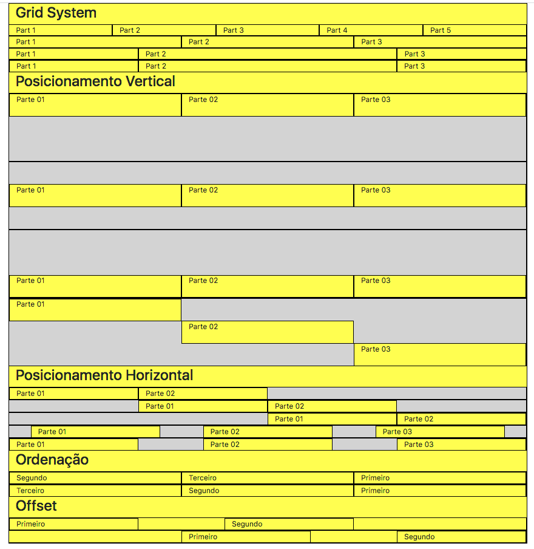

# Bootstrap 4 - Fundamentos básicos

O Bootstrap, um dos mais bem avaliados projetos no GitHub, é um framework CSS criado inicialmente pelo Twitter. Hoje, ele é completamente open source e possui uma vasta comunidade encabeçada pelo Bootstrap Core Team, empenhada em manter o framework em constante evolução. Atualmente, o Bootstrap está na versão 4, uma versão que foi praticamente reescrita em comparação com as versões anteriores.

Uma das maiores inovações do Bootstrap 4 foi a adoção do chamado Flexbox System.

O grid system, em algumas situações, pode se tornar demasiadamente engessado. Imagine uma situação onde você quer dividir uma linha em 5 colunas com o mesmo comprimento... No grid system tradicional, esta divisão não é possível sem a utilização de customizações CSS, tendo em vista que 5 não é múltiplo de 12. Porém, com o Flexbox System, essa divisão torna-se perfeitamente possível sem esforço adicional no Bootstrap 4.

O Flexbox System também é referenciado várias vezes na documentação oficial como simplesmente Bootstrap Flex.

## Testes realizados

* Estudo dos  princípios básicos do funcionamento do Bootstrap: Grid System e Bootstrap Flexbox
* Testes com interface adaptativa e responsiva às mais variadas resoluções e tamanhos de dispositivos.
* Utilização do helper CSS do Bootstrap voltados à questões de alinhamento e disposição de elementos no grid system e no flexbox

## Resultado do teste

